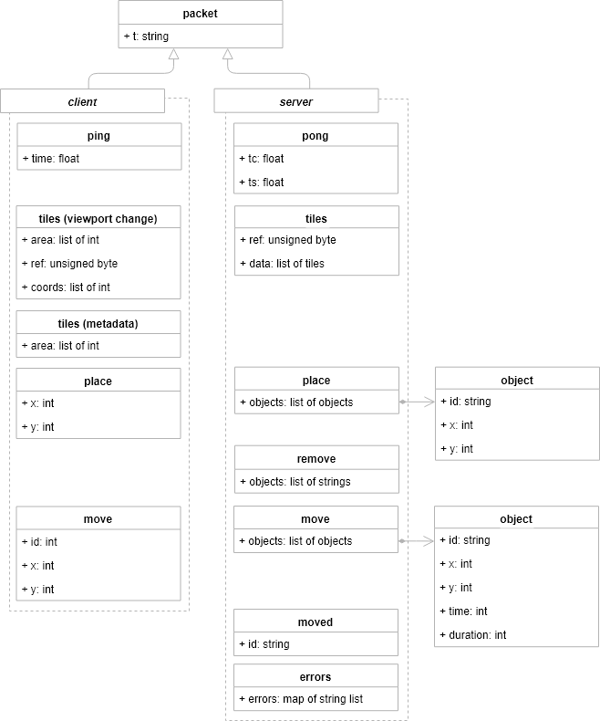

# Infinite Tiles

## Setup

Install dependencies with [npm](https://www.npmjs.com):

    npm i
    npm run lint

Build resources with *mock* api strategy:

    npm run build

or *ws* (web socket), production build:

    NODE_ENV=prod API=ws WS_HOST=ws://192.168.56.10:8080/game npm run build

## Run

Serve files with a web server with hot loading:

    npm start

Open your browser at [http://localhost:8080](http://localhost:8080).

## Protocol

### Packet format

The server accepts connections from web socket client and communicates with it
using *packets*. A packet is a sequence of bytes sent over the web socket
connection using [messagepack](https://msgpack.org/) serialization format.

The meaning of a packet depends on packet type.

| Field Name | Field Type | Notes                                          |
| ---------- | ---------- | ---------------------------------------------- |
| t          | string     | Packet type. Limited to known packet types.    |
|            |            | Depends on the packet type, see details below. |

### errors

Sent by the server when packet validation fails.

| Field Name | Field Type         | Notes                                                        |
| ---------- | ------------------ | ------------------------------------------------------------ |
| t          | string             | errors                                                       |
| errors     | map of string list | The map uses  a key to refer to a particular packet field name and a list of strings for multiple error messages. |

### tiles (viewport change)

Sent by the client when viewport position changes without a need to retrieve corresponding
tiles (because corresponding tile meta information available already).

| Field Name | Field Type                            | Notes                                                        |
| ---------- | ------------------------------------- | ------------------------------------------------------------ |
| t          | string                                | tiles                                                        |
| area       | list of int; [xmin, ymin, xmax, ymax] | Rectangular area related to current viewport (left top and right bottom tiles coordinates). Exactly 4 elements. |

### tiles (metadata)

Sent by the client when viewport position changes and there is a need to retrieve tile metadata.

| Field Name | Field Type                            | Notes                                                        |
| ---------- | ------------------------------------- | ------------------------------------------------------------ |
| t          | string                                | tiles                                                        |
| area       | list of int; [xmin, ymin, xmax, ymax] | see above.                                                   |
| ref        | unsigned byte, [0..127]               | Reference number to match the server response. Incremented for each new request. |
| coords     | list of int; [x,y,...]                | The list of tiles coordinates relative to area xmin, ymin parameters. The length is even number. |

Sent by the server in response to the client request.

| Field Name | Field Type      | Notes                                                        |
| ---------- | --------------- | ------------------------------------------------------------ |
| t          | string          | tiles                                                        |
| ref        | unsigned byte   | Reference number, returned back by the server to match the client request. |
| data       | list of objects | The list of tile metadata corresponding to request coords positions. |

### place

Sent by the client to create a new object at given tile.

| Field Name | Field Type | Notes                         |
| ---------- | ---------- | ----------------------------- |
| t          | string     | place                         |
| x          | int        | The target tile x-coordinate. |
| y          | int        | The target tile y-coordinate. |

Sent by the server to the client to instruct place multiple objects at the given tile coordinates.

| Field Name | Field Type      | Notes                         |
| ---------- | --------------- | ----------------------------- |
| t          | string          | place                         |
| objects    | list of objects | The list of objects to place. |

Object contains any metainformation, e.g. id.

| Field Name | Field Type | Notes                         |
| ---------- | ---------- | ----------------------------- |
| id         | string     | Object id.                    |
| x          | int        | The target tile x-coordinate. |
| y          | int        | The target tile y-coordinate. |

### remove

Sent by the server to the client to remove an object by id.

| Field Name | Field Type | Notes                   |
| ---------- | ---------- | ----------------------- |
| t          | string     | removed                 |
| objects         | list of strings | The list of objects to remove by id. |
